# 中断上下文

中断上下文如图：



## interrupt_entry

在 `interrupt_entry` 函数中增加保存上文寄存器的功能：

````s
interrupt_entry:
    ; 保存上文寄存器信息
    push ds
    push es
    push fs
    push gs
    pusha

    mov eax, [esp + 12 * 4]

    push eax

    call [handler_table + eax * 4]

    add esp, 4

    popa
    pop gs
    pop fs
    pop es
    pop ds

    add esp, 8
    iret
````

所以，之后的程序进入中断后，来到 `interrupt_entry` 就会保存之前运行的这些上下文信息，中断执行完后，再从站取出。


## exception_handler

更新了 `exception_handler`，增加可以打印发生异常时的上文寄存器信息：

````c
void exception_handler(
    int vector,
    u32 edi, u32 esi, u32 ebp, u32 esp,
    u32 ebx, u32 edx, u32 ecx, u32 eax,
    u32 gs, u32 fs, u32 es, u32 ds,
    u32 vector0, u32 error, u32 eip, u32 cs, u32 eflags)
{
    printk("\nEXCEPTION : %s \n", messages[vector]);
    printk("   VECTOR : 0x%02X\n", vector);
    printk("    ERROR : 0x%08X\n", error);
    printk("   EFLAGS : 0x%08X\n", eflags);
    printk("       CS : 0x%02X\n", cs);
    printk("      EIP : 0x%08X\n", eip);
    printk("      ESP : 0x%08X\n", esp);
    // 阻塞
    hang();
}
````

是这样的，假如程序运行到某个位置发生了除 0 异常：

1. CPU　找到 idt 第一个表项，得到 `interrupt_handler_0x00` 函数地址，并执行；
2. 在此函数中，先将 0x20222202 压栈、再把 0x00 压栈；
3. 跳转到（不是调用） `interrupt_entry`，这个过栈没有改变；
4. 将 ds、es、fs、gs 以及其他若干个通过寄存器压栈（通过 `pusha` ），一共压入了 12 个，所以相对于压入之前，`esp` 减小了 12 * 4，所以为得到异常号 0x00，就需要 `mov eax, [esp + 12 * 4]`，把异常序号放入 eax，之后压栈；
5. 调用对应的中断处理函数 `call [handler_table + eax * 4]`，这里使用的是 call，这相当于在压入 12 个寄存器与异常序号之后，执行函数，所以这些都可以看作是中断处理函数的参数。并且第一个参数就是 `call` 执行之前的压栈动作，即异常序号，其他的寄存器也一一对应；（假设异常处理函数最后不执行 `hang`）
6. 执行完函数后（假设异常处理函数最后不执行 `hang`），返回到 `call` 的下一条，此时栈的内容应该和 `call` 之前完全一致，那么为了把寄存器 `pop` 走，需要跳过压入栈中的异常号，所以这里执行了 `add esp, 4`，之后才是一个个 `pop`；
7. 最后再把 `esp` 加 8，跳过入栈的 0x20222202 与 0x00，最后返回到除 0 异常处（对，是回到原来异常的位置，不是下一条）；
8. 异常没有被解决，继续÷0异常...


## task

之前写过一个调度的例子，a、b 两个任务互相调度（任务中显示调用 `schedule` 切换任务）；

由于已经有了时钟中断，可以把那个例子改为由时钟来调度；

首先把默认中断处理寒素 `defalut_handler` 改为：

````c
void default_handler(int vector)
{
    send_eoi(vector);
    schedule();
}
````

这样当时间片到期，就会执行另一个任务；

再把两个任务函数修改一下：

````c
u32 _ofp thread_a()
{
    asm volatile("sti\n");

    while(true)
    {
        printk("A");
    }
}

u32 _ofp thread_b()
{    
    asm volatile("sti\n");

    while(true)
    {
        printk("B");
    }
}
````

为了效率，使用 `_ofp` 取消了两个函数的栈帧，然后去掉其中显示调用 `schedule`；

并且在进入函数之前需要开启中断，这是因为中断的过程中，会自动关闭中断；而这两个函数是有中断处理函数那里调度的，所以需要开启中断；

> 那么为什么一般情况下，中断发生之后，再次返回时不需要手动开中断呢：因为 `interrupt_entry` 中保存了 eflag 寄存器，之后返回的时候会把原来的值读入，就自动开启了中断；