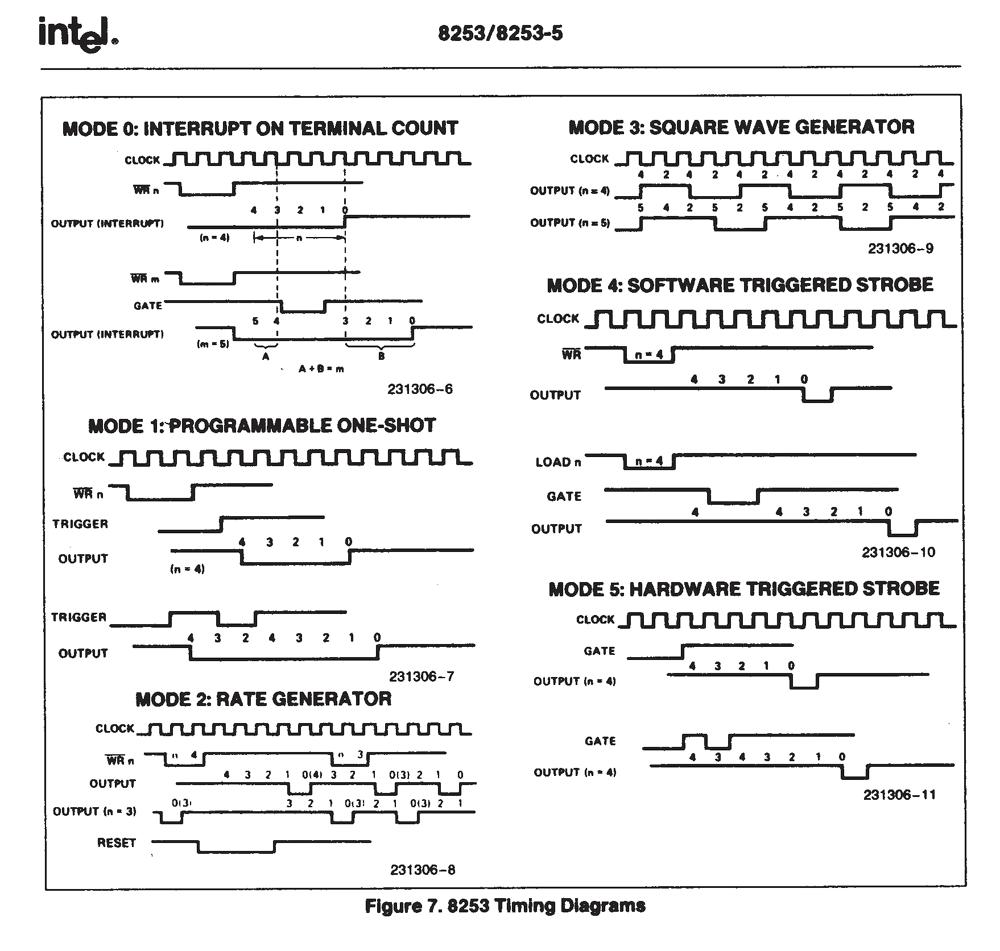

# 计数器和时钟

常用的可编程定时计数器 (Programmable Interval Timer PIT) 有 Intel 8253/8254，其中 8254 可以称为 8253 的增强版。

在 8253 内部有 3 个独立的计数器，分别是计数器 0 ~ 2，端口号分别为 0x40 ~ 0x42；每个计数器完全相同，都是 16 位大小，相互独立，互不干涉。

8253 计数器是个减法计数器，从初值寄存器中得到初值，然后载入计数器中，然后随着时钟变化递减。计数器初值寄存器，计数器执行寄存器，和输出锁存器都是 16 位的寄存器，高八位和低八位可以单独访问。


## 计数器

三个计数器有自己各自的用途：

- 计数器 0，端口号 0x40，用于产生时钟信号，它采用工作方式 3；
- 计数器 1，端口号 0x41，用于 DRAM 的定时刷新控制；
- 计数器 2，端口号 0x42，用于内部扬声器发出不同音调的声音，原理是给扬声器输送某频率的方波；


计数器 0 用于产生时钟中断，就是连接在 IRQ0 引脚上的时钟，也就是控制计数器 0 可以控制时钟发生的频率，以改变时间片的间隔；


## 8253 控制字

控制字寄存器，端口号 0x43，是 8 位寄存器，控制字寄存器也成为模式控制寄存器，用于指定计数器的 工作方式、读写格式 及 数制。

控制字结构：

| 7   | 6   | 5   | 4   | 3   | 2   | 1   | 0   |
| --- | --- | --- | --- | --- | --- | --- | --- |
| SC1 | SC0 | RL1 | RL0 | M2  | M1  | M0  | BCD |


- SC(Select Counter) 0 ~ 1：计数器选择位
    - 00 计数器 0
    - 01 计数器 1
    - 10 计数器 2
    - 11 无效
- RL(Read Load) 0 ~ 1：读写操作位
    - 00 锁存数据，供 CPU 读
    - 01 只读写低字节
    - 10 只读写高字节
    - 11 先读写低字节，后读写高字节
- M (Mode) 0 ~ 2：模式选择
    - 000：模式 0
    - 001：模式 1
    - x10：模式 2
    - x11：模式 3
    - 100：模式 4
    - 101：模式 5
- BCD：(Binary Coded Decimal) 码
    - 0 表示二进制计数器
    - 1 二进制编码的十进制计数器


## 模式

- 模式 0：计数结束时中断
- 模式 1：硬件可重触发单稳方式
- 模式 2：比率发生器，用于分频
- 模式 3：方波发生器
- 模式 4：软件触发选通
- 模式 5：硬件触发选通

模式时序图



## 振荡器

振荡器的频率大概是 1193182 Hz，假设希望中断发生的频率为 100Hz，那么计数器初值寄存器的值为：

$$V = {1193182 \over 100} = 11931$$

## 其他的问题

- 为什么 振荡器 的频率是 1193182 Hz？

最初的 PC 机，使用一个基础振荡器来生成频率，14.31818 MHz，因为这个频率常用于电视线路，这个基础频率除以 3 就得到了频率 4.77272666 MHz 用于 CPU；除以 4 得到频率 3.579545 MHz 用于 CGA 显卡控制器。从逻辑上将前两个频率求最大公约数，就得到了频率 1.1931816666 MHz，这个方案极大的节约了成本，因为 14.31818 MHz 的振荡器可以大量的生产，所以就更便宜。


## 增加时钟中断处理

时钟中断主要是为了任务调度，那么如果直接使用 CPU 自带的时钟，那频率太高了，效果很差。所以需要经过计数器分配以后再作为时钟调度的周期使用，这就利用到上面说的计数器了；

### pic_init

在 `pic_init` 中，先把所有的 16 个外中断都关闭；

> 外中断是可以关闭的，因为它受到 CPU 中两个独立的芯片控制，异常好像就不能了；

````c
    outb(PIC_M_DATA, 0b11111111);
    outb(PIC_S_DATA, 0b11111111);
````

### 使能中断、配置处理函数

增加两个重要的函数：

````c
void set_interrupt_mask(u32 irq, bool enable);
void set_interrupt_handler(u32 irq, handler_t handler);
````

分别用于对某个外中断进行使能或失能、设置某个外中断的处理函数；

实现方法就是对两个芯片的端口进行一定的读写即可：

````c
// 对 irq 号外中断设置处理函数
void set_interrupt_handler(u32 irq, handler_t handler)
{
    assert(irq >= 0 && irq < 16);
    handler_table[IRQ_MASTER_NR + irq] = handler;
}

// 启动或关闭第 irq 号外中断
void set_interrupt_mask(u32 irq, bool enable)
{
    assert(irq >= 0 && irq < 16);
    u16 port;
    // 端口号小于 8 是主片控制的中断
    if (irq < 8)
        port = PIC_M_DATA;
    // 大于 8 是从片控制的中断
    else
    {
        port = PIC_S_DATA;
        irq -= 8;
    }
    // 开启或关闭对应的端口，即使能或失能对应的时钟中断（0 有效）
    if (enable)
        outb(port, inb(port) & (~(1 << irq)));
    else
        outb(port, inb(port) | (1 << irq));
}
````

### clock.c

增加 clock.c 文件，在其中打开计数器，配置时钟中断处理函数与开启时钟中断；