# 内存管理初步

从 loader 的内存检测结果获取可用内存区域，操作形式尽可能兼容 grub multiboot

以下是目前的内存分布图：



- 386/486 内存分页是以 4K = 4096B = 0x1000B 为单位；
- 奔腾处理器引入了以 4M 为单位的页；


## 内存初始化

创建 memory.h 与 memory.c，根据 loader.asm 中内存检测得到的 ards_buffer 与 ards_count 来对内存进行初始化，找到可用使用的内存区域；

> 不同的虚拟机返回的 ards_buffer 与 ards_count 不同，bochs、qemu 有 vm 都可能不相同，这就是做内存检测的意义，可用让操作系统适应不同的硬件；

### start.asm

修改 start.asm，先将做控制台初始化，之后再初始化内存：

````s
_start:
    push ebx; ards_count
    push eax; magic

    call console_init; 控制台初始化
    call memory_init;
    
    jmp $
````

并且很重要的把 ards_count 与操作系统魔数压栈，这样这两个值都可作为 `memory_init` 与 `console_init` 的参数使用；

### 内存大小与边界

在 memory.h 定义两个宏：

````c
#define PAGE_SIZE 0x1000     // 一页的大小 4K
#define MEMORY_BASE 0x100000 // 1M，可用内存开始的位置
````

不管哪个虚拟机，都需要提供起始内存为 0x1000，大小为 1M 的可用内存区域给操作系统；

### 基本的变量、结构体定义

在 memory.c 中定义：

````c
#define LOGK(fmt, args...) DEBUGK(fmt, ##args)

#define ZONE_VALID 1    // ards 可用区域 
#define ZONE_RESERVED 2 // ards 不可用区域

// 获取 addr 的页索引，一页大小为 0x1000，所以每页最底 12 位是 0，右移 12 位得到第几个页
#define IDX(addr) ((u32)addr >> 12) 

typedef struct ards_t
{
    u64 base;   // 内存基地址
    u64 size;   // 内存长度
    u32 type;   // 类型
} _packed ards_t;

u32 memory_base = 0;    // 可用内存基地址，等于 1M
u32 memory_size = 0;    // 可用内存大小
u32 total_pages = 0;    // 所有内存页面数量
u32 free_pages = 0;     // 空闲内存页数量

#define used_pages (total_pages - free_pages);  // 已使用的页数
````

其中，`ards_t` 的结构就对应 loader.asm 做内存检测，BOIS 给出的结构是一样的；

### memory_init

在 memory.c 实现初始化内存函数，其中去掉了打印日志的功能：

````c
void memory_init(u32 magic, u32 addr)
{
    u32 count;
    ards_t* ptr;

    // 如果是 onix loader 进入
    if (magic != ONIX_MAGIC)
        panic("Memory init magic unknow 0x%p\n", magic);

    count = *((u32*)addr);
    // loader.asm 中，定义的，ards_count 下面的内存就是保存 ards 数组的位置
    ptr = (ards_t*)(addr + 4);

    for (size_t i = 0; i < count; ++i, ++ptr)
    {
        if (ptr->type == ZONE_VALID && ptr->size > memory_size)
        {
            memory_base = (u32)(ptr->base);
            memory_size = (u32)(ptr->size);
        }
    }

    assert(memory_base == MEMORY_BASE);
    assert((memory_size & 0xff) == 0);

    total_pages = IDX(memory_size) + IDX(memory_base);
    free_pages = IDX(memory_size);
}
````

- 函数首先根据参数 magic 判断，是不是从 start.asm 中进入的；
- 如果是，就可以继续进行，根据 start.asm 压入栈中的参数，addr 指向的地址是 loader 中获得的：ards_count，即 `ards_t` 结构体数量，而 addr + 4 就得到了 ards_buf，这是一个 `ards_t` 结构体数组；
- 遍历每一个 `ards_t`，找到其中是可用的、并且空间最大的一块；
- 赋值给 `memory_base` 与 `memory_size`；
- 最后计算页的数量与空闲页。