# 内存映射原理 (分页机制)


## 内存管理机制

- 分段：
    - 内存描述符
    - 平坦模型：只分一个段，也就是不分段
- 分页：内存分为 4KB 大小的一个个页；

如下为内存映射机制图：



- 逻辑地址：程序访问的地址
- 线性地址：程序访问的地址 + 描述符中的基地址
- 物理地址：实际内存的位置
- 虚拟地址：虚拟内存的地址

平坦模型中，逻辑地址和线性地址是相同的；

内存映射是将线性地址转换成物理地址的过程；


## 内存分页

- 进程内存空间：程序员在编写程序的时候不知道具体运行的机器
- 虚拟内存：可以使用硬盘来模拟内存

由于一页内存是 4KB，32位总共可以访问 4G 的内存，于是将内存分成了 4G/4K = 1M 个页；

$$
1M = 1024 \times 1024 = 2^{10} \times 2^{10} = 2^{20}
$$

现在要做线性地址和物理地址的一一映射关系，这个映射关系存储在内存中，由于系统中没有 20bit 的数据结构，所以用 32bit 的数据结构来存，那么就需要一个如下的数组来存储：

```c
u32 page_table[1 << 20];
```

其中 `1 << 20` 就是 1M， 由于总共有 1M 个页，一页占用了 4B，所以这个数组尺寸是 4M，这个数组也就是页表；

这个数组也存储在内存中，4M = 1024 * 4K，也就是需要 1024 个页来存储；

由于每个进程都需要一个页表来映射内存，如果直接用这种方式的话，每个进程都需要至少 4M 的内存来存储页表，但是，并不是所有的进程都用到所有 4G 的空间，所以这种方式很不划算，而且 386 的年代，内存比较小，显然不能这样干。

所以就有了页目录，用来表示这 1024 个页，用到了那些页，一页页表用 4B 表示，恰好是 4KB，页表 **恰好** 占用一页的内存；

如果进程只用到了很少的内存的话，就可以只用两个页来表示，这样可以表示 4M 的内存，一页页目录，一页页表，总共用到了 8K，比上面的 4M 节约了不少。当然，如果进程确实用到了全部 4G 的空间，那么就会比 4M 再多一页页目录，不过一般进程不会用到所有的内存，而且操作系统也不允许；

上面的恰好，实际上是有意设计的，之所以恰好，就是因为页的大小是 4KB，这也解释了为什么分页的大小是4KB，如果分成其他的大小，可能页表和页目录就不那么恰好了，当然 4M 的页也是恰好的，只需要一个页表就能表示全部的内存。

但是，分页，页表，页目录的这种策略也并不完全恰好，表示一页 20bit 就够了，但是却用了 32 bit，也就是说 12 bit 可以用来干别的事情；

事实上确实用来干别的事情了，用来表示这页内存的属性，这些属性如下：

**页表**


**页目录**


```c
typedef struct page_entry_t
{
    u8 present : 1;  // 在内存中
    u8 write : 1;    // 0 只读 1 可读可写
    u8 user : 1;     // 1 所有人 0 超级用户 DPL < 3
    u8 pwt : 1;      // page write through 1 直写模式，0 回写模式
    u8 pcd : 1;      // page cache disable 禁止该页缓冲
    u8 accessed : 1; // 被访问过，用于统计使用频率
    u8 dirty : 1;    // 脏页，表示该页缓冲被写过
    u8 pat : 1;      // page attribute table 页大小 4K/4M
    u8 global : 1;   // 全局，所有进程都用到了，该页不刷新缓冲
    u8 ignored : 3;  // 该安排的都安排了，送给操作系统吧
    u32 index : 20;  // 页索引
} _packed page_entry_t;
```

这个结构体是有意构造的，恰好占 4 个字节，一页内存可以表示下面这样一个数组；

```c++
page_entry_t page_table[1024];
```

## 内存映射


### CR3 寄存器


### CR0 寄存器



1. 首先准备一个页目录，若干页表
2. 将映射的地址写入页表，将页表写入页目录
3. 将页目录写入 cr3 寄存器
4. 将 cr0 最高位 (PG) 置为 1，启用分页机制


## 前 1M 内存的映射

### 寄存器相关函数

首先实现三个函数：

```c
// 获取 cr3 寄存器
u32 get_cr3()
{
    asm volatile("movl %cr3, %eax\n");
}

// 设置 cr3 寄存器
void set_cr3(u32 pde)
{
    ASSERT_PAGE(pde);
    asm volatile("movl %%eax, %%cr3\n" ::"a"(pde));
}

// 将 cr0 寄存器最高位 PG 设置位 1，启动分页
static void enable_page()
{
    // 0b1000_0000_0000_0000_0000_0000_0000_0000
    asm volatile(
        "movl %cr0, %eax\n"
        "orl $0x80000000, %eax\n"
        "movl %eax, %cr0\n");
}
```

来获取、设置 cr3 寄存器，并且设置 cr0 寄存器的最高位为 1，表示开启了分页机制；

### 初始化页表项

传入一个页表项地址，初始化：

````c
// 初始化页表项
static void entry_init(page_entry_t* entry, u32 index)
{
    // 首先全部清零
    *(u32*)entry = 0;
    entry->present = 1;
    entry->write = 1;
    entry->user = 1;
    // 这个页表项指向物理内存的 index 号页面
    entry->index = index;
}
````

### 内存映射

内存映射函数如下：

````c
// 内核页目录，这个页面保存页目录
#define KERNEL_PAGE_DIR 0x200000

// 内核页表
#define KERNEL_PAGE_ENTRY 0x201000

// 内存映射初始化
void mapping_init()
{
    // 将 KERNEL_PAGE_DIR 的位置视为 page_entry_t，并且设置为 0
    // PS: pde -> page diretory entry，表示页目录项，所以 KERNEL_PAGE_DIR 所在的这一页就作为系统的页目录
    page_entry_t* pde = (page_entry_t*)KERNEL_PAGE_DIR;
    memset(pde, 0, PAGE_SIZE);

    // 将最开始的一个页目录项指向 KERNEL_PAGE_ENTRY
    entry_init(&pde[0], IDX(KERNEL_PAGE_ENTRY));

    // 将 KERNEL_PAGE_ENTRY 的位置作为 page_entry_t
    // PS: pte -> page table entry，表示页表项，所以这是张页表，而且是系统中的第一张页表，
    // 起始地址保存在系统页目录的第 0 个表项
    page_entry_t* pte = (page_entry_t*)KERNEL_PAGE_ENTRY;
    page_entry_t* entry;
    // 把 pte 作为页表的起始地址，初始化这个页面中 1024 个页表项
    // 要把前 1M -> 1024 个页面映射到一一映射到此页表的 1024 个表项
    for (size_t tidx = 0; tidx < 1024; tidx++)
    {
        entry = &pte[tidx];
        // 将这个页表第 i 个表项指向的整个内存的第 i 个页面
        entry_init(entry, tidx);
        memory_map[tidx] = 1;
    }

    // 设置 ccr3 
    set_cr3((u32)pde);

    // 开启分页有效
    enable_page();
}
````

其中注释很清楚，不多说。函数调用完毕后，CPU 开启了分页机制，之后的每一次读取内存都要经过映射；

这个函数完成了：将前 1M 逻辑地址经过地址映射后得到的物理地址不变。比如程序给出 0x10101 这个逻辑地址：

1. 0x10101 = 0000 0000 0000 0001 0000 0001 0000 0001 -> 0000000000 0000010000 0000000100000001，这三段分别表示：页目录索引、页表索引、页内部偏移；
2. 根据 cr3 寄存器的值 0x200000（这个值暂时是这个）找到页目录表，得到第 0 个表项的地址：0x201000；
3. 根据这个地址找到页表，得到页表的第 0000010000 个表项，这个表项的 index 字段的值为 0000010000;
4. 到物理内存中找第 0000010000 个页面，根据偏移得到最后的物理地址为 0000000000 0000010000 0000000100000001 与逻辑地址相同！

> 只要把页目录与页表配置好即可，打开分页后，硬件会自动完成这些任务；

根据分析，完成这个映射的关键有两点：

- 前 1M 内存的最高 8 位全部为 0，所以把这些页面都放在 0 号页目录项保存的页表中；
- 这个页面的第 i 项对应物理内存的第 i 个页面；

而最后 12 位是页内偏移，逻辑地址与物理地址的都一定是一样的，不需要映射。