# 内核内存映射

## 如何得到 cr3 逻辑地址

cr3 保存了页目录的起始物理地址，但开启分页后程序中出现的所有地址都应该是逻辑地址，所以不可以再直接使用分页前定义的页目录地址直接访问；

一个小技巧就是让页目录的最后一个页目录项指向页目录本身，形成类型这样的结构：



这样设置之后，逻辑地址的 0xfffff000 - 0xffffffff 这个部分，在地址变化中会连续找到两两个表的后一表项，还是得到页目录地址 0x1000；

再加上偏置，逻辑地址 0xfffff000 - 0xffffffff 被映射到物理地址 0x1000 - 0x1fff；

又对逻辑地址 0xffc00000 - 0xffc01fff，首先还是找到页目录表的最后一项，还是指向页目录，再找其中前两个表项（也即前两个页表）的所有项目，即找到了两个页表的物理地址，得到了：逻辑地址 0xffc00000 - 0xffc01fff 到物理地址 0x2000 - 0x3fff 的映射；

> 以上分析假设页目录地址为 0x1000，0、1 号页表地址为 0x2000 与 0x3000；

这样还可定义两个辅助函数：

````c
// 通过页目录最后一个表项找到页面，通过页面的最后一个表项找到页面
// 因为 pde 最后一个表项指向本身，所以找了两次最后一项，最后得到 pde 地址；
// 所以开启分页后 0xffffff000 映射到 0x1000
static page_entry_t* get_pde()
{
    return (page_entry_t*)(0xfffff000);
}

// 根据 vaddr 最高 10 位作为索引，作为页目录的索引，得到 vaddr 地址对应的页目录项
static page_entry_t* get_pte(u32 vaddr)
{
    return (page_entry_t*)(0xffc00000 | (DIDX(vaddr) << 12));
}
````

对第二个函数，会先得到 vaddr 的页目录所以，将这 10 位移动到页面目录的位置，再或上 0xffc00000 作为逻辑地址：

1. 先根据高 10 位的 0b1111111111，找到页目录的最后一项，本来应该是一个页表，但这里比较特殊，指向的还是页目录；
2. 根据 `DIDX(vaddr)`，即 vaddr 的页目录索引，再去页目录找，得到一个页面地址；
3. 把这个地址解释为 `page_entry_t*`，综上，这个函数返回 vaddr 这个逻辑地址对应在页目录中的页表地址。


## 完成内核内存映射

希望映射成为这样的页面分布：



- 开始的 8M 物理内存（0x0 - 0x800000）给内核使用；
- 之后的可用区域给用户态程序使用；

### 辅助宏

首先定义一些辅助宏：

````c
// 获取 addr 的页索引，一页大小为 0x1000，所以每页最底 12 位是 0，右移 12 位得到第几个页
#define IDX(addr) ((u32)addr >> 12) 
// 获取 addr 的页目录索引
#define DIDX(addr) (((u32)addr >> 22) & 0x3ff)
// 获取 addr 的页表索引
#define TIDX(addr) (((u32)addr >> 12) & 0x3ff)
// 由页面索引，得到页面起始地址
#define PAGE(idx) ((u32)idx << 12)
````

### 定义页目录、页表地址

系统的页目录位于 0x1000，开始的两个页面位于 0x2000 与 0x3000，两个页表有 2048 个表项，对应 2048 = 2K 页，每个页面 4K，所以足够映射 8M 内存：

````c
// 内核页目录索引
#define KERNEL_PAGE_DIR 0x1000

// 内核页表索引
static u32 KERNEL_PAGE_TABLE[] = {
    0x2000,
    0x3000,
};
````

### 内存映射初始化

````c
// 内存映射初始化
void mapping_init()
{
    // 将 KERNEL_PAGE_DIR 的位置视为 page_entry_t，并且设置为 0
    // PS: pde -> page diretory entry，表示页目录项，所以 KERNEL_PAGE_DIR 所在的这一页就作为系统的页目录
    page_entry_t* pde = (page_entry_t*)KERNEL_PAGE_DIR;
    memset(pde, 0, PAGE_SIZE);

    idx_t index = 0;

    // 对内核的每一个页面
    for (idx_t didx = 0; didx < (sizeof(KERNEL_PAGE_TABLE) / 4); didx++)
    {
        // 得到页面起始地址，并且清空页面
        page_entry_t* pte = (page_entry_t*)(KERNEL_PAGE_TABLE[didx]);
        memset(pte, 0, PAGE_SIZE);

        // 设置页目录项目
        page_entry_t* dentry = &pde[didx];
        entry_init(dentry, IDX((u32)pte));

        // 设置页面的 1024 个表项目
        // 每次设置一个页目录都让 index + 1，使得所有页面顺序映射内存的起始部分内存
        for (size_t tidx = 0; tidx < 1024; tidx++, index++)
        {
            // 第 0 也不映射，为了造成空指针访问，缺页异常，排查错误
            if (index == 0) 
                continue;
            
            // 对每一个页目录设置，指向内存的第 index 个页面
            page_entry_t* tentry = &pte[tidx];
            entry_init(tentry, index);
            memory_map[index] = 1;
        }
    }

    // 页目录的最后一个页目录项，指向页目录所在的页面，这样就可用在开启分页后修改页目录与页表
    entry_init(entry, IDX(KERNEL_PAGE_DIR));

    // 设置 cr3 
    set_cr3((u32)pde);

    // 开启分页有效
    enable_page();
}
````

将逻辑地址 0x1000 - 0x7FFFFF 映射到物理地址 0x1000 - 0x7FFFFF；


## 内存映射的方法

举例，指定的内存映射：

````c
void memory_test()
{
    // 将 20M-> 物理地址 0x1400000 内存映射到 64M 逻辑地址 0x4000000 的位置
    BMB;
    u32 vaddr = 0x4000000;
    u32 paddr = 0x1400000;
    u32 table = 0x900000;

    page_entry_t* pde = get_pde();
    page_entry_t* dentry = &pde[DIDX(vaddr)];
    entry_init(dentry, IDX(table));

    // 不可以直接用 table 的值，因为这个是物理地址，在程序中不能直接使用
    page_entry_t* pte = get_pte(vaddr);
    page_entry_t* tentry = &pte[TIDX(vaddr)];

    entry_init(tentry, IDX(paddr));

    // 现在 0x4000000 的虚拟地址对应 物理地址 0x1400000
    char* ptr = (char*)(0x4000000);
    ptr[0] = 'a';

    entry_init(tentry, IDX(0x1500000));
    flush_tlb(vaddr);
    // 现在 0x4000000 的虚拟地址对应 物理地址 0x1500000
    ptr[2] = 'c';
}
````

## 刷新快表

- `mov cr3, eax`
- `invlpg`

```c++
// 刷新虚拟地址 vaddr 的 快表 TLB
static void flush_tlb(u32 vaddr)
{
    asm volatile("invlpg (%0)" ::"r"(vaddr)
                 : "memory");
}
```

