# 用户内存映射

8M 之后的内存给用户使用，内存布局如图：



实现两个函数来对一个逻辑页面映射物理内存页面：

```c++
// 将 vaddr 映射物理内存
void link_page(u32 vaddr)
{
    ASSERT_PAGE(vaddr);

    // 得到一个页表，指明需要创建，如果存在那也不需要创建
    page_entry_t* pte = get_pte(vaddr, true);
    // 计算页表项地址 pte + 中间 10 位偏移
    page_entry_t* entry = pte + (TIDX(vaddr));

    task_t* task = running_task();
    bitmap_t* map = task->vmap;
    // 页面在位图中的索引
    u32 index = IDX(vaddr);

    // 如果页面存在，直接返回
    if (entry->present)
    {
        assert(bitmap_test(map, index));
        return;
    }

    assert(!bitmap_test(map, index));
    // 设置 bitmap 对应索引位置为真，表示在内存中有了真实的页面
    bitmap_set(map, index, true);

    // 找到一个空页
    u32 paddr = get_page();
    // 初始化页面的这个表项指向 paddr 的页面号
    entry_init(entry, IDX(paddr));
    flush_tlb(vaddr);

    LOGK("LINK from 0x%p to 0x%p", vaddr, paddr);
}

// 去掉 vaddr 对应物理内存映射
void unlink_page(u32 vaddr)
{
    ASSERT_PAGE(vaddr);

    // 得到页表与页表项
    page_entry_t* pte = get_pte(vaddr, false);
    page_entry_t* entry = pte + TIDX(vaddr);

    // 得到内存位图与逻辑地址的页目录号
    task_t* task = running_task();
    bitmap_t* map = task->vmap;
    u32 index = IDX(vaddr);

    // 如果本来就没有映射关系
    if (!entry->present)
    {
        assert(!bitmap_test(map, index));
        return;
    }
    assert(entry->present && bitmap_test(map, index));

    // 设置存在位为 0
    entry->present = false;
    bitmap_set(map, index, false);

    // 得到原来对应的物理地址
    u32 paddr = PAGE(entry->index);
    LOGK("UNLINK from 0x%p to 0x%p", vaddr, paddr);
    
    // 物理地址可以被多个进程使用，如果存在只有一个进程使用，就可以把这个页面释放掉
    if (memory_map[entry->index] == 1)
        put_page(paddr);

    flush_tlb(vaddr);
}
```

注释很充分，并且由于页目录项不一定都存在了，所以之前 `get_pte` 需要修改：

````c
// 根据 vaddr 最高 10 位作为索引，作为页目录的索引，得到 vaddr 地址对应的页目录项
static page_entry_t* get_pte(u32 vaddr, bool create)
{
    // return (page_entry_t*)(0xffc00000 | (DIDX(vaddr) << 12));
    // 得到页目录与要找的页表在页目录的索引
    page_entry_t* pde = get_pde();
    u32 idx = DIDX(vaddr);
    // entry 可能不存在
    page_entry_t* entry = pde + idx;

    // 创建或（已经存在不创建）
    assert(create || (!create && entry->present));
    
    // 实际上 vaddr 应该对应的页表地址（一个页表起始地址可以有两个逻辑地址，因为页目录的最后一项是本身）
    page_entry_t* table = (page_entry_t*)(PDE_MASK | (idx << 12));

    // 如果页表不存在，需要创建
    if (!entry->present)
    {
        LOGK("Get and create page table entry ofr 0x%p\n", vaddr);
        // 申请一个页表
        u32 page = get_page();
        // 配置页目录项，指向 page 所在的页面
        entry_init(entry, IDX(page));
        memset(table, 0, PAGE_SIZE);
    }

    return table;
}
````

> `unlink_page` 函数不会检查页面是不是所有的表项都不存在，进程结束一起回收，这是因为程序运行的局部性原理！
