# 创建内核线程

## 进程控制块

定义 PCB 如下：



在 task.c 中实现：

````c
typedef enum task_state_t
{
    TASK_INIT,      // 初始化
    TASK_RUNNING,   // 运行
    TASK_REDAY,     // 就绪
    TASK_BLOCKED,   // 阻塞
    TASK_SLEEPING,  // 休眠
    TASK_WAITING,   // 等待
    TASK_DIED,      // 死亡
} task_state_t;

typedef struct task_t
{
    u32* stack;             // 内核栈
    task_state_t state;     // 任务状态
    u32 priority;           // 任务优先级，每次初始化 tick 的值
    u32 ticks;              // 剩余时间片，每次时钟后减去 1，到 0 调度
    u32 jiffies;            // 上次执行时全局时间片
    char name[TASK_NAME_LEN];// 任务名称
    u32 uid;                // 用户 id
    u32 pde;                // 页目录物理地址
    struct bitmap_t* vmap;  // 进出虚拟内存位图
    u32 magic;              // 内核魔数，校验溢出
} task_t;
````


## 内核线程调度

这次的目标是完成时钟中断对三个不同任务的调度，如下图：



内核初始化函数 `kernel_init` 完成初始化工作后，进入任务 A，之后再进入 B、再进入 C，最后又回到 A，以此往复，就不会就回到 `kernel_init` 了；

同之前所设计的那样，每个页面放一个任务，页面的起始位置是 PCB，描述当前任务的信息；

### PCB 数组

在 task.c 中定义一个 `task_t` 指针的数组：

````c
#define NR_TASKS 64
static task_t* task_table[NR_TASKS];
````

用来保存当前系统中存在的任务；

### 获得空闲 PCB

在 `task_table` 中查找，找到第一个为空的指针，并且为其分配一页的空间（也就是一个新任务）：

````c
static task_t* get_free_task()
{
    for (size_t i = 0; i < NR_TASKS; ++i)
    {
        if (task_table[i] == NULL)
        {
            task_table[i] = (task_t*)alloc_kpage(1);
            return task_table[i];
        }
    }
    panic("No more tasks");
}
````

> 注意，这个函数还会把分配到的任务指针赋值给 `task_table`；

### 查找某种状态的任务

从 `task_table` 中查找，要求返回的任务状态与参数 `state` 一致，并且不可以为当前的任务：

````c
static task_t* task_search(task_state_t state)
{
    // 原子操作，保证中断被关闭
    assert(!get_interrupt_state());
    task_t* task = NULL;
    task_t* current = running_task();

    for (size_t i = 0; i < NR_TASKS; ++i)
    {
        task_t* ptr = task_table[i];
        if (ptr == NULL)
            continue;

        if (ptr->state != state)
            continue;
        if (current == ptr)
            continue;
        
        // 找到 ticks 更大或 jiffies 更小的
        if (task == NULL || task->ticks < ptr->ticks || ptr->jiffies < task->jiffies)
            task = ptr;
    }
    
    return task;
}
````

函数会先看满足条件的任务中，剩余时间片 `ticks` 更大的。当剩余时间片相同，再找上一次执行时系统总时间小的（`jiffies` 小说明了距离，任务上次执行的时间更久，就需要优先执行）；

### 获得当前任务

````c
task_t* running_task()
{
    // 当前运行的页面起始处保存 task_t 结构体
    asm volatile(
        "movl %esp, %eax\n"
        "andl $0xfffff000, %eax\n"
    );
}
````

每个 PCB 位于页面的起始位置；

### 调度函数

当某个任务时间片到期，就使用 `schedule` 进行调度：

````c
void schedule()
{
    // 获取当前、与下一关任务
    task_t* current = running_task();
    task_t* next = task_search(TASK_REDAY);

    assert(next != NULL);
    assert(next->magic == ONIX_MAGIC);

    // 切换当前任务状态
    if (current->state == TASK_RUNNING)
        current->state = TASK_REDAY;
    
    if (!current->ticks)
        current->ticks = current->priority; 

    // 切换下一关任务状态
    next->state = TASK_RUNNING;
    if (next == current)
        return;
    
    task_switch(next);
}
````

首先得到当前任务、再调用 `task_search(TASK_READT)` 得到一个处于准备态的任务，并且要么时间片长或最久没有执行；

之后更新当前与下一关任务的状态，之后调用 `task_switch` 跳转到下一关任务；

>  `task_switch` 使用汇编定义在 schedule.asm 中；

### 创建任务

没什么好解释捏：

````c
static task_t* task_create(target_t target, const char* name, u32 priority, u32 uid)
{
    task_t* task = get_free_task();
    memset(task, 0, PAGE_SIZE);

    // 页尾做栈顶（高地址）
    u32 stack = (u32)task + PAGE_SIZE;

    // 空出部分内存做位 task_frame_t
    stack -= sizeof(task_frame_t);
    task_frame_t* frame = (task_frame_t*)stack; 
    frame->ebx = 0x11111111;
    frame->esi = 0x22222222;
    frame->edi = 0x33333333;
    frame->ebp = 0x44444444;
    frame->eip = (void*)target;

    strcpy((char*)(task->name), name);

    task->stack = (u32*)stack;
    task->priority = priority;
    task->ticks = task->priority;
    task->jiffies = 0;
    task->state = TASK_REDAY;
    task->uid = uid;
    task->vmap = &kernel_map;
    task->pde = KERNEL_PAGE_DIR;
    task->magic = ONIX_MAGIC;

    return task;
}
````

### 启动任务

在内核初始化任务中，执行函数，把当前任务设置一下魔数（这很重要），其实就是把当前函数所在页面的起始位置设置了一点；

````c
static void task_setup()
{
    // 获取当前任务
    task_t* task = running_task();
    task->magic = ONIX_MAGIC;
    task->ticks = 1;

    // 设置起始任务数组为空
    memset(task_table, 0, sizeof(task_table));
}
````

最后把 `task_table` 都设置为空指针；

### 定义三个任务

每个任务都需要打开中断，这个之前也解释过。

````c
u32 thread_a()
{
    set_interrupt_state(true);
    while (true)
        printk("A");
}

u32 thread_b()
{
    set_interrupt_state(true);
    while (true)
        printk("B");
}

u32 thread_c()
{
    set_interrupt_state(true);
    while (true)
        printk("C");
}
````

### 任务初始化

````c
void task_init()
{
    task_setup();

    task_create(thread_a, "thread a", 5, KERNEL_USER);
    task_create(thread_b, "thread b", 5, KERNEL_USER);
    task_create(thread_c, "thread c", 5, KERNEL_USER);
}
````

先启动任务，之后创建三个任务，分别执行三个任务函数，并且三个任务的 pro 都是 5，说明三个任务都是执行 5 个时间片后才调度；

### 时钟中断处理

修改时钟中断处理函数，加上任务调度：

````cs
void clock_handler(int vector)
{
    assert(vector == 0x20);
    send_eoi(vector);
    stop_beep();

    jiffies++;
    
    task_t* task = running_task();
    assert(task->magic == ONIX_MAGIC);

    task->jiffies = jiffies;
    task->ticks--;
    if (!task->ticks)
    {
        task->ticks = task->priority;
        schedule();
    }
}
````

进入处理函数后，首先获得当前任务，时间片减一，更新 `jiffies`，最后如果时间片到期，进行调度；

### 内核初始化

````c
void kernel_init()
{
    interrupt_init();
    memory_map_init();
    mapping_init();
    clock_init();
    task_init();
    asm volatile("sti\n");
    hang();
}
````

在内存初始化中加上 `task_init`；


## 工作原理

在 loader.asm 中，将内核栈设置在 0x100000 的位置，所以在 `kernel_init` 函数中都是运行在 1M 这个页面中。分别在内存的 0x101000、0x102000、0x103000 三个创建任务，`task_table` 的前 3 项也得到了这三个指针；

最后由于时间片还没到期，内核在 `kernel_init` 中 `hang()`；

当一旦时间片到期，进入了 `clock_handler`，会执行：

````c
    task_t* task = running_task();
    assert(task->magic == ONIX_MAGIC);
````

此时的 `task` 应该指向 0x100000，接下来要判断魔数，这就是为什么在 `task_setup` 中赋值魔数的原理；

最后进入的 `schedule`，根据分析，它找到 `task_init` 的 A 任务，进行了 `task_switch`，完成了栈的切换、与 eip 的跳转；（之前都分析过不再重复）

之后就进行 5 次时钟中断，每次中断让任务 A 的时间片 - 1，最后到期继续调度，此时会执行 B；

依次类推，再到 C 任务；

不同与任务第一次执行，函数地址与寄存器初始值是由 `task_frame_t` 给出的，之后的所有信息都会保存在栈中（这个之前也说过了）；

就这样，三个任务不断交替执行；
