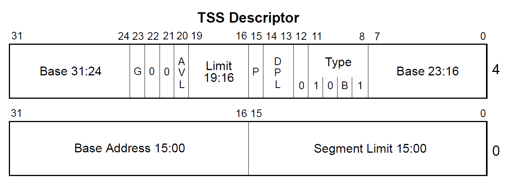

# 任务状态段简介

## 任务特权级环 (Protection Rings)


## 任务状态段

一个任务分为两个部分：

- 执行空间
- 状态空间

任务状态段 (TSS Task State Segment) 是 IA32 中一种二进制数据结构，保存了某个任务的信息，保护模式中 TSS 主要用于硬件任务切换，这种情况下，每个任务有自己独立的 TSS，对于软件的任务切换，也通常会有一两个任务状态段，使得任务从在中断时，能从 用户态(Ring3) 转到 内核态(Ring0)；

在硬件任务切换中，任务状态段保存了很多寄存器的信息，任务状态段的结构如下：


```c++
typedef struct tss_t
{
    u32 backlink; // 前一个任务的链接，保存了前一个任状态段的段选择子
    u32 esp0;     // ring0 的栈顶地址
    u32 ss0;      // ring0 的栈段选择子
    u32 esp1;     // ring1 的栈顶地址
    u32 ss1;      // ring1 的栈段选择子
    u32 esp2;     // ring2 的栈顶地址
    u32 ss2;      // ring2 的栈段选择子
    u32 cr3;
    u32 eip;
    u32 flags;
    u32 eax;
    u32 ecx;
    u32 edx;
    u32 ebx;
    u32 esp;
    u32 ebp;
    u32 esi;
    u32 edi;
    u32 es;
    u32 cs;
    u32 ss;
    u32 ds;
    u32 fs;
    u32 gs;
    u32 ldtr;          // 局部描述符选择子
    u16 trace : 1;     // 如果置位，任务切换时将引发一个调试异常
    u16 reversed : 15; // 保留不用
    u16 iobase;        // I/O 位图基地址，16 位从 TSS 到 IO 权限位图的偏移
    u32 ssp;           // 任务影子栈指针
} _packed tss_t;
```

硬件任务切换主要和任务门有关，使得任务切换时，CPU 可以自动保存任务上下文，但是这样干会很低效，所以现代操作系统一般不会用这种方法，而且为了更高的可移植性，也更应该使用软件的方式来做任务切换。

## 任务状态段描述符

系统段和门描述符类型，当 segment = 0 时

| 类型 | 描述             |
| ---- | ---------------- |
| 0000 | 保留             |
| 0001 | 16 位 TSS (可用) |
| 0010 | LDT              |
| 0011 | 16 位 TSS (忙)   |
| 0100 | 16 位 调用门     |
| 0101 | 任务门           |
| 0110 | 16 位 中断门     |
| 0111 | 16 位 陷阱门     |
| 1000 | 保留             |
| 1001 | 32 位 TSS (可用) |
| 1010 | 保留             |
| 1011 | 32 位 TSS (忙)   |
| 1100 | 32 位 调用门     |
| 1101 | 保留             |
| 1110 | 32 位 中断门     |
| 1111 | 32 位 陷阱门     |



任务状态段描述符，描述了当前正在执行的任务，B 表示busy 位， B 位为 0 时，表示任务不繁忙， B 位为 1 时，表示任务繁忙。

CPU 提供了 TR(Task Register) 寄存器来存储该描述符，加载描述符到 TR 寄存器中的指令是：

    ltr

使用 TSS 的主要作用是利用其中的 `ss0` 和 `esp0`，使得用户态的程序可以转到内核态。

- NT (Nested Task)
- IOPL (IO Privilege Level)


## 设置 tss

理论上，每个用户进程都拥有一个 tss 段，当这个进程发送任务切换，会保存当前进程的寄存器信息，之后再恢复；

所以每切换到一个新的进程，都会更新一下 CPU 中的 TR 寄存器，让 TR 保存当前进程的 tss 起始地址；

但是，目前还没有那么完善的机制，系统中就只有一个 tss，而且 tss 也不是用作任务切换，主要是为了用户态与内核态保存 esp 与 ss。由于只涉及到 00 与 11 两个级别，所以只需要使用 esp0 与 ss0；

### 相关宏定义

在 global.h 定义：

````c
// 各个全局描述符在全局描述符表的索引：
#define KERNEL_CODE_IDX 1
#define KERNEL_DATA_IDX 2
#define KERNEL_TSS_IDX 3

#define USER_CODE_IDX 4
#define USER_DATA_IDX 5
```` 

增加用户代码、用户数据、TSS 全局描述符在 gdt 的索引；

> 一个全局描述符来描述一段内存，tss 是一段保存在内存中的数据，所以也用全局描述符来描述；

加上段选择子：

````c
// 各个全局描述符的段选择子
#define KERNEL_CODE_SELECTOR (KERNEL_CODE_IDX << 3)
#define KERNEL_DATA_SELECTOR (KERNEL_DATA_IDX << 3)
#define KERNEL_TSS_SELECTOR (KERNEL_TSS_IDX << 3)

#define USER_CODE_SELECTOR (USER_CODE_IDX << 3 | 0b11)
#define USER_DATA_SELECTOR (USER_DATA_IDX << 3 | 0b11)
````

对内核的三个，后三位都是 0（selector_t 结构体定义），而对用户的两个描述符，最后三位数是 0b11，表示用户等级；

### 全局 tss

在 global.c 中定义全局 tss：

````c
tss_t tss;
````

### gdt 初始化

给 `gdt_init` 中增加用户数据、代码全局描述符的设置：

````c
void gdt_init()
{
    DEBUGK("init gdt!!!\n");

    memset(gdt, 0, sizeof(gdt));

    ...

    // 配置用户代码段全局描述符号，位于 gdt 的 4 号索引
    desc = gdt + USER_CODE_IDX;
    descriptor_init(desc, 0, 0xFFFFF);
    desc->segment = 1;     // 数据段
    desc->granularity = 1; // 4K
    desc->big = 1;         // 32 位
    desc->long_mode = 0;   // 不是 64 位
    desc->present = 1;     // 在内存中
    desc->DPL = 3;         // 用户特权级
    desc->type = 0b1010;   // 代码 / 非依从 / 可读 / 没有被访问过

    // 配置用户数据段全局描述符，位于 gdt 的 5 号索引
    desc = gdt + USER_DATA_IDX;
    descriptor_init(desc, 0, 0xFFFFF);
    desc->segment = 1;     // 数据段
    desc->granularity = 1; // 4K
    desc->big = 1;         // 32 位
    desc->long_mode = 0;   // 不是 64 位
    desc->present = 1;     // 在内存中
    desc->DPL = 3;         // 用户特权级
    desc->type = 0b0010;   // 数据 / 向上增长 / 可写 / 没有被访问过

    // 保存 gdt
    gdt_ptr.base = (u32)&gdt;
    gdt_ptr.limit = sizeof(gdt) - 1;
}
````

目前用户还可用修改内核代码，之后会修改；

### tss 初始化

在 global.c 增加 `tss_init` 函数：

```c
void tss_init()
{
    memset(&tss, 0, sizeof(tss));

    tss.ss0 = KERNEL_DATA_SELECTOR;
    tss.iobase = sizeof(tss);

    // 配置 TSS 全局描述符，位于 gdt 的 1 号索引
    descriptor_t* desc = gdt + KERNEL_TSS_IDX;
    descriptor_init(desc, (u32)&tss, sizeof(tss) - 1);
    desc->segment = 0;      // 系统段
    desc->granularity = 0;  // 长度单位为字节
    desc->big = 0;          // 固定为 0
    desc->long_mode = 0;    // 固定为 0
    desc->present = 1;      // 在内存中
    desc->DPL = 0;          // 任务门或调用门
    desc->type = 0b1001;    // 32 为可用 tss

    // 使用 ltr 将 tss 选择子保存
    asm volatile(
        "ltr %%ax\n" ::"a"(KERNEL_TSS_SELECTOR));
}
```

并且在 `kernel_init` 中调用，就可以完成对 tss 的初始化，可以看到，此时 tss 中的 ss0 是内核数据的选择子；

现在系统中就有了 6 个全局描述符：

- 0 号要求全 0；
- 1 号为内核代码段；
- 2 号为内核数据段；
- 3 号为 tss 段；
- 4 号为用户代码段；
- 5 号为用户数据段。


