# 进入用户模式

## 任务特权级环

## 任务状态段

- ss0
- esp0

## 中断门处理过程

如果处理程序运行在低特权级，那么栈切换就会发生：

- 内核特权级的 栈段选择子 和 栈顶指针 将会从当前的 TSS 段中获得，在内核栈中将会压入用户态的 栈段选择子 和 栈顶指针；
- 保存当前的状态 eflags, cs, eip 到内核栈
- 如果存在错误码的话，压入错误码

如果处理器运行在相同的特权级，那么相同特权级的中断代码将被执行：

- 保存当前的状态 eflags, cs, eip 到内核栈
- 如果存在错误码的话，压入错误码

## 进入用户模式

- 内核栈 Return Oriented Programming 
- 用户栈
- 中断返回

内核发生中断：

用户发生中断：

