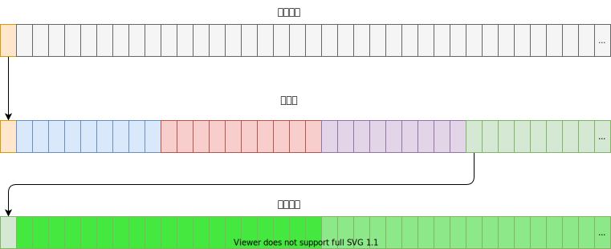

# 硬盘分区

为了实现多个操作系统共享硬盘资源，硬盘可以在逻辑上分为 4 个主分区。每个分区之间的扇区号是邻接的。分区表由 4 个表项组成，每个表项由 16 字节组成，对应一个分区的信息，存放有分区的大小和起止的柱面号、磁道号和扇区号。

分区表存放在硬盘的 0 柱面 0 头第 1 个扇区的 0x1BE ~ 0x1FD 处。

| 位置 | 大小  | 名称           | 说明                                    |
| ---- | ----- | -------------- | --------------------------------------- |
| 0x00 | 8 位  | bootable       | 引导标志 / 0 - 不可引导 / 0x80 - 可引导 |
| 0x01 | 8 位  | start_head     | 分区起始磁头号                          |
| 0x02 | 6 位  | start_sector   | 分区起始扇区号                          |
| 0x03 | 10 位 | start_cylinder | 分区起始柱面号                          |
| 0x04 | 8 位  | system         | 分区类型字节 / 用于表示文件系统         |
| 0x05 | 8 位  | end_head       | 分区的结束磁头号                        |
| 0x06 | 6 位  | end_sector     | 分区结束扇区号                          |
| 0x07 | 10 位 | end_cylinder   | 分区结束柱面号                          |
| 0x08 | 32 位 | start          | 分区起始物理扇区号 lba                  |
| 0x0c | 32 位 | count          | 分区占用的扇区数                        |

## 扩展分区

扩展分区是一种可以多加 4 个分区的方式。如果分区表中的 SystemID 字段的值位 0x5，表示该分区为扩展分区。

可以将扩展分区的所有扇区组合起来认为是一个新的磁盘，然后再对其进行分区，这种逻辑有点套娃，所以如果磁盘空间足够大，理论上可以分出无数个分区。

## 创建硬盘分区

可以通过 `fdisk` 命令对磁盘进行分区，具体参考 <https://wiki.archlinux.org/title/Fdisk>

然后可以将分好区的分区信息备份：

    sfdisk -d /dev/... > master.sfdisk

有分区信息可以直接对磁盘进行分区：

    sfdisk /dev/... < master.sfdisk

可以将磁盘挂载到系统：

    sudo losetup /dev/loop0 --partscan master.img

或者取消挂载：

    sudo losetup -d /dev/loop0

## GPT

GPT是一个更先进的分区标准，在 UEFI 下被作为推荐的分区机制。它不包含 MBR 分区表的人为 24 位或 32 位限制。它还增强了分区表的概念，通常比 MBR 方案复杂得多。

