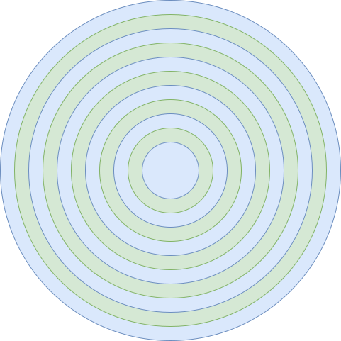

# 磁盘调度电梯算法

由于磁盘性能的主要瓶颈在磁盘的寻道时间，也就是磁头臂的移动时间，所以要尽可能避免磁头臂的移动。电梯算法的作用是让磁头的综合移动距离最小，从而改善磁盘访问时间。



## LBA 和 CHS

-  LBA (Logical Block Addressing)：逻辑块寻址，逻辑上认为磁盘的扇区编号从 0 开始依次递增，处理起来更方便；
-  Sector: 扇区，磁盘最小的单位，多个扇区够称一个磁道
-  Head: 磁头，用于读写盘面，一个磁盘可能有多个磁头，一个磁道读写完成，就换另一个磁头；
-  Cylinder：柱面，或者也可以认为是磁道 (Track)，同一个位置的所有磁道共同构成了柱面；当所有磁道都读写完时，就需要切换磁道，也就产生了寻道的问题。因此柱面是磁盘读写最大的单位。

下面是 LBA 和 CHS 的转换公式：

- CYL = LBA / (HPC * SPT)

- HEAD = (LBA % (HPC * SPT)) / SPT

- SECT = (LBA % (HPC * SPT)) % SPT + 1

- LBA = ( ( CYL * HPC + HEAD ) * SPT ) + SECT - 1

其中：

- CYL 表示柱面 (Cylinder)
- HEAD 表示磁头 (Head)
- SECT 表示扇区 (Sector)
- LBA 表示逻辑块地址 (Logical Block Addressing)
- HPC 表示柱面磁头数 (Head Per Cylinder)
- SPT 表示磁道扇区数 (Sector Per Track)


## 电梯算法实现

### 按序插入

在构建请求链表的时候，不使用直接的插入，而是按磁道大小的顺序排序：

````c
// 块设备请求
void device_request(dev_t dev, void *buf, u8 count, idx_t idx, int flags, u32 type)
{
    device_t *device = device_get(dev);
    assert(device->type = DEV_BLOCK); // 是块设备
    idx_t offset = idx + device_ioctl(device->dev, DEV_CMD_SECTOR_START, 0, 0);

    // 如果是块，就找到其所在磁盘进行操作
    if (device->parent)
        device = device_get(device->parent);

    // 创建一个请求结构体，赋上参数
    request_t *req = kmalloc(sizeof(request_t));
    req->dev = device->dev;
    req->buf = buf;
    req->count = count;
    req->idx = offset;
    req->flags = flags;
    req->type = type;
    req->task = NULL;

    // 判断当前设备的请求列表是否为空
    bool empty = list_empty(&device->request_list);

    // 将请求插入链表
    list_insert_sort(
        &(device->request_list), &(req->node),
        element_node_offset(request_t, node, idx)
    );

    // 如果列表不为空，则阻塞，因为已经有请求在处理了，等待处理完成；
    if (!empty)
    {
        req->task = running_task();
        task_block(req->task, NULL, TASK_BLOCKED);
    }

    // 阻塞解开或链表为空，可用处理这个请求
    do_request(req);

    // 获得下一关请求
    request_t* next_req = request_next_req(device, req);

    // 处理完，释放节点，释放内存空间
    list_remove(&req->node);
    kfree(req);

    // 如果此时链表还有请求，就唤醒最后一个——先来先服务策略
    if (next_req)
    {
        assert(next_req->task->magic == ONIX_MAGIC);
        task_unblock(next_req->task);
    }
}
````

### 扫描获取下一关

获取下一关请求时，使用扫描链表的方式：先从头到尾，到最后一个再从尾到头，往复运动：

````c
static request_t* request_next_req(device_t* device, request_t* req)
{
    list_t* list = &(device->request_list);

    // 调度到最大的磁道，更改方向
    if (device->direct == DIRECT_UP && req->node.next == &(list->tail))
        device->direct = DIRECT_DOWN;
    // 调度到早小的磁道，更改方向
    else if (device->direct == DIRECT_DOWN && req->node.prve == &(list->head))
        device->direct = DIRECT_UP;

    void* next = NULL;
    // 如果磁道方向向上，就取当前的下一个请求
    if (device->direct == DIRECT_UP)
        next = req->node.next;
    // 如果磁道方向向下，就取当前的上一个请求
    else
        next = req->node.prve;
    
    // 已经没有请求，返回空
    if (next == &(list->head) || next == &(list->tail))
        return NULL;

    return element_entry(request_t, node, next);
}
````