# 程序加载和执行

根据 ELF [^elf] 文件格式，将代码和数据加载到用户内存，并执行。

进程内存布局如下：



使用系统调用：

```c
int execve(char* filename, char* argvp[], char* envp[]);
```

将创建一个新进程，执行 `filename` 文件（ELF 可执行文件）；


## 修改 `task_t` 

在 task_t 结构体增加一些字段：

````c
typedef struct task_t
{
    ...
    u32 text;                           // 代码段地址
    u32 data;                           // 数据端地址
    u32 end;                            // 程序结束地址
    struct inode_t* iexec;              // 程序文件 inode
    ...
} task_t;
````

## `sys_exec` 实现

`exec` 系统调用的实现函数为：

````c
int sys_execve(char* filename, char* argvp[], char* envp[])
{
    inode_t* inode = namei(filename);
    int ret = EOF;
    if (!inode)
        goto rollback;
    
    // 不是常规文件
    if (!ISFILE(inode->desc->mode))
        goto rollback;

    // 文件不可执行
    if (!permission(inode, P_EXEC))
        goto rollback;

    task_t* task = running_task();
    strncpy(task->name, filename, TASK_NAME_LEN);

    // TODO 处理参数与环境

    // 释放原程序的堆内存
    task->end = USER_EXEC_ADDR;
    sys_brk(USER_EXEC_ADDR);

    // 加载程序
    u32 entry = load_elf(inode);
    if (entry == EOF)
        goto rollback;

    // 设置堆内存地址
    sys_brk((u32)(task->end));

    iput(task->iexec);
    task->iexec = inode;

    intr_frame_t* iframe = (intr_frame_t*)((u32)task + PAGE_SIZE - sizeof(intr_frame_t));
    iframe->eip = entry;
    iframe->esp = (u32)USER_STACK_TOP;
    
    // ROP，伪装中断返回，eip 指向 entry
    asm volatile(
        "movl %0, %%esp\n"
        "jmp interrupt_exit\n" ::"m"(iframe)
    );

rollback:
    iput(inode);
    return ret;
}
````

1. 获取 `filename` 的 inode；
2. 做文件类型与权限的检测；
3. 设置当前进程结构体中的进程名称；
4. 调用 `load_elf` 加载可执行文件，获得返回值：程序起始地址；
5. 设置堆内存地址；
6. 设置栈顶，伪装为中断返回（eip 与 esp）；
7. 执行 `interrupt_exit`。

实现的思路就将文件中的各个段根据 ELF 文件格式读入到内存，映射好物理页，最后使用 ROP 技术，伪装成中断返回，进入到用户程序执行；


## `load_elf` 实现

调用 `load_elf` 函数将文件中的数据导入内存；

```c
static u32 load_elf(inode_t* inode)
{
    // 给用户程序做物理页映射
    link_page(USER_EXEC_ADDR);

    int n = 0;
    // 读取 ELF 文件头，读取到 USER_EXEC_ADDR 位置
    n = inode_read(inode, (char*)USER_EXEC_ADDR, sizeof(Elf32_Ehdr), 0);
    assert(n == sizeof(Elf32_Ehdr));

    // 验证
    Elf32_Ehdr* ehdr = (Elf32_Ehdr*)USER_EXEC_ADDR;
    if (!elf_validate(ehdr))
        return EOF;

    // 读取程序段头表，读取到 ELF 文件头后
    Elf32_Phdr* phdr = (Elf32_Phdr*)(USER_EXEC_ADDR + sizeof(Elf32_Ehdr));
    n = inode_read(inode, (char*)phdr, ehdr->e_phnum * ehdr->e_phentsize, ehdr->e_phoff);

    // 根据程序段头表，读取段头
    Elf32_Phdr* ptr = phdr;
    for (size_t i = 0; i < ehdr->e_phnum; ++i)
    {
        // 如果这个段可加载
        if (ptr->p_type != PT_LOAD)
            continue;
        load_segment(inode, ptr);

        // 遍历段头表的每一项
        ptr++;
    }
    
    // 返回程序的入口地址
    return ehdr->e_entry;
}
```

1. 给用户程序做物理页映射；
2. 读取 ELF 文件头，读取到 USER_EXEC_ADDR 位置；
3. 验证 ELF 文件头中的信息；
4. 根据程序段头表，读取段头，如果这个段可加载，调用 `load_segment` 函数将这个段复制到内存中；
5. 返回函数入口地址；


## `load_segment` 实现

将传入的段头表对应的那个段加载到内存中：

````c
static void load_segment(inode_t* inode, Elf32_Phdr* phdr)
{
    // 对齐到页
    assert(phdr->p_align == 0x1000);
    assert((phdr->p_vaddr & 0xfff) == 0);

    u32 vaddr = phdr->p_vaddr;

    // 需要的页面数量
    u32 count = div_round_up(MAX(phdr->p_memsz, phdr->p_filesz), PAGE_SIZE);

    // 对每一页：计算起始内存位置，链接一个物理页
    for (size_t i = 0; i < count; ++i)
    {
        u32 addr = vaddr + i * PAGE_SIZE;
        assert(addr >= USER_EXEC_ADDR && addr < USER_MMAP_ADDR);
        link_page(addr);
    }

    // 读取文件到内存中
    inode_read(inode, (char*)vaddr, phdr->p_filesz, phdr->p_offset);

    // 如果内存中需要的字节比文件保存的多，即 .bss 段，剩下的部分全部填充 0
    if (phdr->p_filesz < phdr->p_memsz)
        memset((char*)vaddr + phdr->p_filesz, 0, phdr->p_memsz - phdr->p_filesz);

    // 如果段不可写，设置为只读（代码段）
    if ((phdr->p_flags & PF_W) == 0)
    {
        // 对每个页面：取出页表项，设置不可写、只读
        for (size_t i = 0; i < count; i++)
        {
            u32 addr = vaddr + i * PAGE_SIZE;
            page_entry_t* entry = get_entry(addr, false);
            entry->write = false;
            entry->readonly = true;
            flush_tlb(addr);
        }
    }

    // 更新进程结构体中的信息
    task_t* task = running_task();
    // 可读、可执行：代码段
    if (phdr->p_flags == (PF_R  | PF_X))
    {
        task->text = vaddr;
    }
    // 可读、可写：数据段
    else if (phdr->p_flags == (PF_R | PF_W))
    {
        task->data = vaddr;
    }

    task->end = MAX(task->end, (vaddr + count * PAGE_SIZE));   
}
````

1. 检查内存对齐；
2. 计算这个段需要多少页面（根据段头表中的信息）；
3. 对每一页：计算起始内存位置，链接一个物理页；
4. 读取段的内容到内存中；
5. 如果内存中需要的字节比文件保存的多，即 .bss 段，剩下的部分全部填充 0（都根据段头表中的信息判断）；
6. 如果这个段不可写，设置为只读（代码段），实现的方法是：对每个页面，取出页表项 `page_entry_t`，设置不可写、只读；
7. 更新进程结构体中的信息；


## 参考

[^elf]: <https://refspecs.linuxfoundation.org/elf/elf.pdf>
