# 参数和环境变量

调用 `execve` 系统调用时，操作系统会把参数 `argv` 和环境变量 `envp` 拷贝到用户栈顶，然后跳转到程序入口地址。

参数和环境变量的内存布局如下图所示：



需要在指向程序之前，把内部布局配置成上图；


## 参数拷贝

在 `sys_execve` 函数中增加：`copy_argv_envp` 拷贝参数：

````c
static u32 copy_argv_envp(char* filename, char* argv[], char* envp[])
{
    // 计算参数数量
    int argc = count_argv(argv) + 1;
    int envc = count_argv(envp);

    // 分配内核内存，用于临时存储参数
    u32 pages = alloc_kpage(4);
    u32 pages_end = pages + 4 * PAGE_SIZE;

    // 内核临时栈顶地址
    char* ktop = (char*)pages_end;
    // 用户栈顶地址
    char* utop = (char*)USER_STACK_TOP;

    // 内核参数
    char** argvk = (char**)alloc_kpage(1);
    // NULL 结尾
    argvk[argc] = NULL;

    // 内核环境变量
    char** envpk = argvk + argc + 1;
    envpk[envc] = NULL;

    int len = 0;
    // 拷贝 envp
    for (int i = envc - 1; i >= 0; i--)
    {
        // 计算长度
        len = strlen(envp[i]) + 1;
        // 得到拷贝地址
        ktop -= len;
        utop -= len;
        // 拷贝字符串到内核
        memcpy(ktop, envp[i], len);
        // 数组中保存的是用户态地址
        envpk[i] = utop;
    }

    // 拷贝 argv，结尾有个 NULL
    for (int i = argc - 1; i > 0; i--)
    {
        // 计算长度
        len = strlen(argv[i - 1]) + 1;
        // 得到拷贝地址
        ktop -= len;
        utop -= len;
        // 拷贝字符串到内核
        memcpy(ktop, argv[i - 1], len);
        // 数组中保存的是用户态地址
        argvk[i] = utop;
    }

    // 拷贝 argv[0]
    len = strlen(filename) + 1;
    ktop -= len;
    utop -= len;
    memcpy(ktop, filename, len);
    argvk[0] = utop;

    // 将 envp 数组拷贝内核
    ktop -= (envc + 1) * 4;
    memcpy(ktop, envpk, (envc + 1) * 4);

    // 将 argv 数组拷贝到内核
    ktop -= (argc + 1) * 4;
    memcpy(ktop, argvk, (argc + 1) * 4);

    // 为 argc 赋值
    ktop -= 4;
    *(int*)ktop = argc;

    assert((u32)ktop > pages);

    // 将参数和环境变量拷贝到用户栈
    len = (pages_end - (u32)ktop);
    utop = (char* )(USER_STACK_TOP - len);
    memcpy(utop, ktop, len);

    // 释放内存
    free_kpage((u32)argvk, 1);
    free_kpage(pages, 4);

    return (u32)utop;
}
````

代码的过程见[图](../00-系统结构体/参数拷贝.drawio);

> 这个图有点画错了，高低地址画反了，不过问题不大！！


## 封装基础命令

现在操作系统可以执行程序了，将下面几个命令封装为程序，由 `exec` 执行：

- echo: 将命令行的参数，输出到标准输出；
- cat: 打印文件内容
- ls: 显示目录内容

程序定义在 echo.c、cat.c、ls.c 中；

当 bash 不能直接匹配到有函数的命令，就：

````c
    stat_t statbuf;
    sprintf(buf, "/bin/%s.out", argv[0]);
    if (stat(buf, &statbuf) == EOF)
    {
        printf("osh: command not found: %s\n", argv[0]);
        return;
    }
    return builtin_exec(buf, argc - 1, &argv[1]);
````

会找到 bin 下有没有对应名称的程序，如果有就用 `exec` 执行这个程序；

## 参考

- <https://www.gnu.org/software/libc/manual/2.36/html_mono/libc.html#Program-Arguments>
- <https://www.gnu.org/software/coreutils/>
