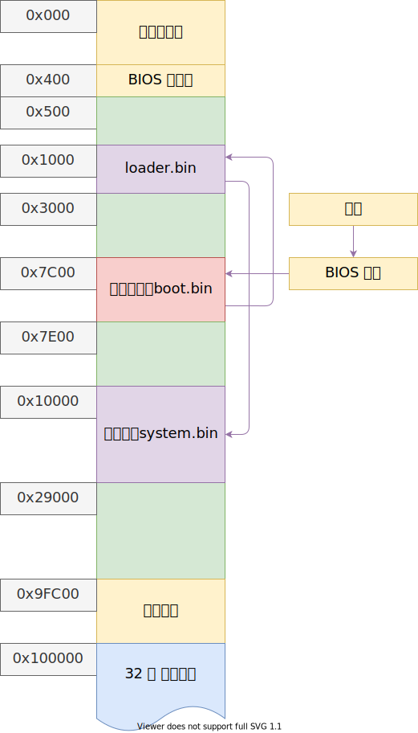

# 小结

### 内存布局

bootloader 阶段：

1. 加电
2. BIOS 自检 将主引导扇区读入 `0x7C00`
3. 进入主引导扇区 [boot.asm](../../src/boot/boot.asm)
   1. 清空屏幕
   2. 初始化段寄存器
   3. 读取 loader
   4. 跳转到 loader 执行
4. 进入 loader [loader.asm](../../src/boot/loader.asm)
   1. 检测内存
   2. 准备保护模式
      1. 打开 A20 线
      2. 加载 GDT
      3. 启动保护模式
      4. 跳转到保护模式
   3. 进入保护模式
   4. 加载段选择子
   5. 修改栈顶
   6. 读取内核
   7. 传入内存参数
   8. 跳转到内核执行

当前内存空间：

1. 进入内核 [start.asm](../src/kernel/../../../src/kernel/start.asm)
2. 初始化虚拟设备
3. 初始化控制台
4. 初始化全局描述符（兼容 grub）
5. 加载选择子
6. 初始化内存，得到内存大小
7. 初始化内核：[main.c](../src/kernel/../../../src/kernel/main.c)
   1. 初始化任务状态段
   2. 初始化物理内存管理数组
   3. 映射内核内存，启用分页机制
   4. 初始化内核堆内存管理
   5. 初始化中断
   6. 初始化时钟
   7. 初始化键盘
   8. 初始化时间
   9. 初始化实时时钟（目前没用到）
   10. 初始化串口
   11. 初始化 IDE 硬盘
   12. 初始化虚拟磁盘
   13. 初始化系统调用
   14. 初始化任务
   15. 初始化高速缓冲
   16. 初始化文件
   17. 初始化 inode
   18. 初始化超级块
   19. 开中断
8.  初始化完成，等待时钟中断，进行调度
9.  进入 init 内核线程
10. 初始化设备
11. 准备转入用户模式，执行 `/bin/init` 程序
12. 执行 `/bin/osh` 程序，进入交互模式

## 展望

另一方面，我们还有很多很必要的功能没有实现，比如：

- 错误处理：这个挺重要的，目前的处理方法绝大多数使用 `assert` 逃避了错误的处理，强假设程序能够完美的运行，这个假设在现实中是不合理的，错误理应得到处理。
- 命名管道：这个实现起来比较容易
- 信号：首先需要错误处理，因为信号的实现方式可能会打破原来程序的阻塞，也就是引入信号后，因等待数据的阻塞解除阻塞后，可能数据并没有准备好，而仅仅是 `SIGINT` 信号，希望程序马上结束。另外信号还提供了一种用户态多线程切换的方法。
- CSI 序列：我们现在的控制台打印出来的信息，黑底灰字，单调无比，CSI 序列可以控制打印出多彩的字符；
- TTY 设备：用于字符设备的交流
- PCI 总线操作
- 网络协议栈：计算机应该联网，不然了无生机；
- 图形界面：这个世界应该是多彩的
- 音频设备：这个世界也应该是动听的
- 动态链接与程序加载重定位
- 软盘驱动：已经实现
- 光盘驱动
- 扩展到 64 位 long mode
- 其他架构的移植
- FPU 的使用
- X86 其他功能的介绍：局部描述符，RPL
- 中断下半部
- 定时器
- 鼠标
- 其他存储设备协议：
   - SATA
   - NVME
   - USB