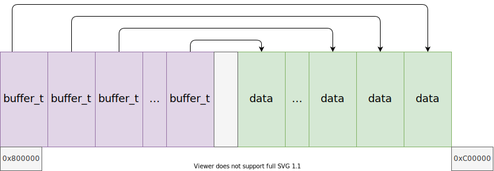

# 哈希表和高速缓冲

## 哈希表

哈希表：散列表，以关键字和数据 (key - value) 的形式直接进行访问的数据结构。

- 哈希函数：需要将 key 转换成整型，并且不同的 key 之间尽可能减少冲突；
- 冲突的解决方法：
    - 开放地址法
    - 拉链法
- 平均时间复杂度 $O(1)$
- 装载因子 load factor
- DDoS 攻击

## 高速缓冲

一般来说，性能不同的两个系统之间应该有一个缓冲区；

文件系统以块为单位访问磁盘，块一般是 $2^n, n \in \mathbb{N}$ 个扇区。其中 4K 比较常见；这里我们使用 1K，也就是 2 个扇区作为一块。

高速缓冲将块存储在哈希表中，以降低对磁盘的访问频率，提高性能。

另外还有一个空闲块链表；

## 内存布局



## 高速缓冲实现

告诉缓冲的布局：



### 相关结构体定义

在 buffer.h 中定义：

````c
// 块大小
#define BLOCK_SIZE 1024
// 扇区大小
#define SECTOR_SIZE 512
// 一块站两个扇区
#define BLOCK_SECS (BLOCK_SIZE / SECTOR_SIZE)

// buffer_t 结构体，描述一个缓冲块的信息
typedef struct buffer_t
{
    char* data;         // 数据区
    dev_t dev;          // 设备号
    idx_t block;        // 块号
    int count;          // 引用计数
    list_node_t hnode;  // 哈希表拉链节点
    list_node_t rnode;  // 缓冲节点
    lock_t lock;        // 锁
    bool dirty;         // 是否与磁盘不一致
    bool vaild;         // 是否有效
} buffer_t;

buffer_t* getblk(dev_t dev, idx_t block);
buffer_t* bread(dev_t dev, idx_t block);
void bwrite(buffer_t* bf);
void brelse(buffer_t* bf);
````

首先是一个缓冲块的大小为 1024 个字节，两倍扇区。之后的 `buffer_t` 结构体用来描述一块缓冲块，如图：


描述了这个缓冲块的：

- 在内存中的起始地址；
- 属于哪个设备的缓冲；
- 这个设备的哪个块；
- 这个块的内容被使用了几次；
- 缓冲块中的内容是否与磁盘中的一致；
- 缓冲块中的内容是否有效；

其中还有两个链表节点：

- `hnode` 是使得 `buffer_t` 结构体可作为哈希表的元素插入到表中。当创建一个缓存后，通过 `dev` 设备号与 `idx` 块号来查找这个 `buffer_t`，最终通过其定位到内存中的缓冲，这里使用的是拉链哈希表来保存创建好的 `buffer_t` 结构体；
- `rnode` 是构成空闲链表的。对缓冲区来说，是需要用的时候就创建一个，并且由图，一个缓冲区结构体 `buffer_t` 只能管理一个块，这个是不能改变的。那么如果已经申请了三个缓冲区，但此时第二个不需要了，就被释放了。而接下来如果需要用到的话还是直接从第四个开始使用。这样由可能导致虽然已经有缓冲区被释放了，但是申请不到新的情况。所以需要一个结构来保存那些被申请了，但是已经被释放的 `buffer_t`；

### 全局变量定义

在 buffer.c 中定义：

````c
// 哈希数量，应该是一个素数
#define HASH_COUNT 31

static buffer_t* buffer_start = (buffer_t*)KERNEL_BUFFER_MEM;
static u32 buffer_count = 0;

// 记录当前 buffer_t 结构体的位置
static buffer_t* buffer_ptr = (buffer_t*)KERNEL_BUFFER_MEM;

// 记录当前数据缓冲区位置
static void* buffer_data = (void*)(KERNEL_BUFFER_MEM + KERNEL_BUFFER_SIZE - BLOCK_SIZE);

// 缓存链表，被释放的块
static list_t free_list;
// 等待进行链表
static list_t wait_list;
// 缓存哈希表
static list_t hash_table[HASH_COUNT];
````

- `HASH_COUNT` 表示保存 `buffer_t` 结构体的哈希表链表个数；
- `buffer_ptr` 与 `buffer_data` 来表示目前的 `buffer_t` 结构体与缓冲区已经申请到哪里，每申请一个缓冲区，`buffer_ptr` 增加一个 `buffer_t` 结构体的字节数量，`buffer_data` 减小一个缓冲区大小。其实一开始就可以把所有 `buffer_t` 与缓冲区配对好，之后就可直接使用，但比较耗时，所以这里是用一个申请一个；
- `free_list`：保存申请了，又被释放的那些 `buffer_t`；
- `wait_list`：当内存中的缓冲区全部都使用，又有新的进程要申请，就需要阻塞等待，这个链表保存等待的进程；
- `hash_table`：保存当前有效的 `buffer_t` 结构体，通过设备号与块号就可用快速定位到内存的缓冲区位置。

### 哈希表相关函数

#### 哈希函数：

````c
u32 hash(dev_t dev, idx_t block)
{
    // 最大也只能是 HASH_COUNT
    return (dev ^ block) & HASH_COUNT;
}
````

#### 将 bf 放入哈希表

````c
static void hash_locate(buffer_t* bf)
{
    u32 idx = hash(bf->dev, bf->block);
    list_t* list = hash_table + idx;
    assert(!list_search(list, &(bf->hnode)));
    list_push(list, &(bf->hnode));
}
````

#### 将 bf 取出哈希表

````c
static void hash_remove(buffer_t* bf)
{
    u32 idx = hash(bf->dev, bf->block);
    list_t* list = hash_table + idx;
    assert(list_search(list, &(bf->hnode)));
    list_remove(&(bf->hnode));
}
````

#### 从哈希表取出一个 `buffer_t`

````c
static buffer_t* get_from_hash_table(dev_t dev, idx_t block)
{
    // 先找数组
    u32 idx = hash(dev, block);
    list_t* list = hash_table + idx;
    buffer_t* bf = NULL;

    // 再遍历链表
    for (list_node_t* node = list->head.next; node != &(list->tail); node = node->next)
    {
        buffer_t* ptr = element_entry(buffer_t, hnode, node);
        if (ptr->dev == dev && ptr->block == block)
        {
            bf = ptr;
            break;
        }
    }

    // 没找到，返回空指针
    if (!bf)
        return NULL;

    // bf 存在缓存列表，移除
    if (list_search(&free_list, &(bf->rnode)))
        list_remove(&(bf->rnode));

    return bf;
}
````

传入设备号与块号，如果这个块被注册了，就返回管理缓存的结构体，如果没有就返回 `NULL`；

> 一个缓冲区被创建后就会放入哈希表，就算没有被使用了，之后也不会取出。所以如果得到的 `buffer_t` 在 `free_list` 中，需要将其弹出；

### 缓冲区相关函数

#### 从内存初始化一个缓冲区

````c
// 在内存中初始化一个 buffer 
static buffer_t* get_new_buffer()
{
    buffer_t* bf = NULL;    
    // 判断内存是否足够
    if ((u32)buffer_ptr + sizeof(buffer_t) < (u32)buffer_data)
    {
        bf = buffer_ptr;
        bf->data = buffer_data;
        bf->dev = EOF;
        bf->block = 0;
        bf->count = 0;
        bf->dirty = false;
        bf->vaild = false;
        lock_init(&(bf->lock));
        buffer_count++;
        buffer_ptr++;
        buffer_data -= BLOCK_SIZE;
        LOGK("buffer count %d\n", buffer_count);
    }

    return bf;
}
````

函数会判断 `buffer_ptr` 与 `buffer_data` 直接够不够形成一个缓冲区，如果可用就创建，给 `buffer_t` 结构体附默认值，更新两个指针的值。如果内存不够就返回 `NULL`；

#### 获得空闲的缓冲区：

````c
static buffer_t* get_free_buffer()
{
    buffer_t* bf = NULL;
    while (true)
    {
        // 如果内存足够，直接获得缓冲
        bf = get_new_buffer();
        if (bf)
            return bf;
        
        // 否则，从空闲列表获得
        if (!list_empty(&(free_list)))
        {
            // 取最远没有被访问的块
            bf = element_entry(buffer_t, rnode, list_popback(&free_list));
            hash_remove(bf);
            bf->vaild = false;
            return bf;
        }

        // 等待某个缓冲释放
        task_block(running_task(), &(wait_list), TASK_BLOCKED);
    }
}
````

先使用 `get_new_buffer` 函数从内存中创建，如果内存没有足够的空间创建缓冲区，就从 `free_list` 拿，如果 `free_list` 也满了，就等待其他进程释放缓冲区，进入阻塞；

#### 申请一个缓冲区

使用设备号与块号，创建一个缓冲区，返回对应的 `buffer_t` 结构体：

````c
buffer_t* getblk(dev_t dev, idx_t block)  
{
    // 先从已经创建好的哈希表中找
    buffer_t* bf = get_from_hash_table(dev, block);
    if (bf)
        return bf;

    // 哈希表没有找到 dev 设备的 block 块缓存，尝试去构建一个
    bf = get_free_buffer();
    assert(bf->count == 0);
    assert(bf->dirty == 0);

    // 赋上相应的值
    bf->count = 1;
    bf->dev = dev;
    bf->block = block;
    // 把创建好的缓存放入哈希表中
    hash_locate(bf);
    return bf;
}
````

1. 首先查看哈希表中是否已经存在这个块的缓存，有就直接返回；
2. 如果没有，再调用 `get_free_buffer`，这个函数可能会阻塞，但最后总是可以得到一个缓冲区；
3. 把得到的缓冲区初始化，并且放入哈希表中，方便下次直接读取；

#### 通过缓冲区读取设备

给定一个设备号与块号，需要使用带缓存的方式读取：

````c
buffer_t* bread(dev_t dev, idx_t block)
{
    buffer_t* bf = getblk(dev, block);
    assert(bf != NULL);
    if (bf->vaild)
    {
        bf->count++;
        return bf;
    }

    device_request(bf->dev, bf->data, BLOCK_SECS, bf->block * BLOCK_SECS, 0, REQ_READ);

    bf->dirty = false;
    bf->vaild = true;
    return bf;
}
````

1. 首先调用 `getblk` 函数申请一个缓冲区，得到 `buffer_t` 结构体；
2. 增加这个缓冲区的应用数量（可能多个进程都使用）；
3. 使用 `device_request` 函数来读取这个设备的这个块的内容，读取一个缓冲区的大小；
4. 此时刚刚读取到磁盘的信息，所以 “不脏”，可用；
5. 返回管理缓冲区的 `buffer_t`；

得到了 `buffer_t` 之后，就可以把其中的 `data` 字段看成设备，向其中读写。若想要写入的内容更新到真实设备，再调用 `bwrite`；

#### 将缓冲区的内容写入磁盘

直接给出 `buffer_t` 结构体即可，其实保存着设备的信息：

````c
void bwrite(buffer_t* bf)
{
    assert(bf);
    if (!bf->dirty)
        return;
    device_request(bf->dev, bf->data, BLOCK_SECS, bf->block * BLOCK_SECS, 0, REQ_WRITE);
    bf->dirty = false;
    bf->vaild = true;
}
````

会先判断一下缓冲区 “脏”，如果没有修改就说明都不用做，如果脏了就把缓冲区写入磁盘，然后更新缓冲区非 “脏”；

#### 释放缓冲区

一个缓冲区不想要了：

````c
void brelse(buffer_t* bf)
{
    if (!bf)
        return;
    if (bf->dirty)
        bwrite(bf);

    bf->count--;
    assert(bf->count >= 0);
    if (bf->count) // 还有人用，直接返回
        return;

    assert(!bf->rnode.next);
    assert(!bf->rnode.prve);
    list_push(&free_list, &bf->rnode);
    if (!list_empty(&wait_list))
    {
        task_t *task = element_entry(task_t, node, list_popback(&wait_list));
        task_unblock(task);
    }
}
````

引用计数减一，表示少了一个进程使用。如果发现没有进程使用了，就可以把 `buffer_t` 加入到 `free_list` 中；

最后，如果发现 `wait_list` 中还有进程，说明之前有进程没有得到缓冲区，于是唤醒最后一个进程； 

### 更新内核内存区

之前的内核占 8M 物理内存，逻辑地址的 8M 与物理地址一一映射。由于需要使用缓冲区，就其扩展到 16M。需要更新一些宏与页表；